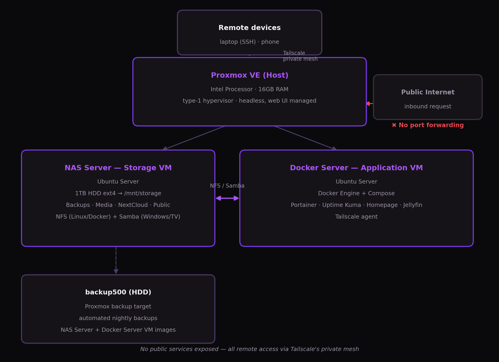
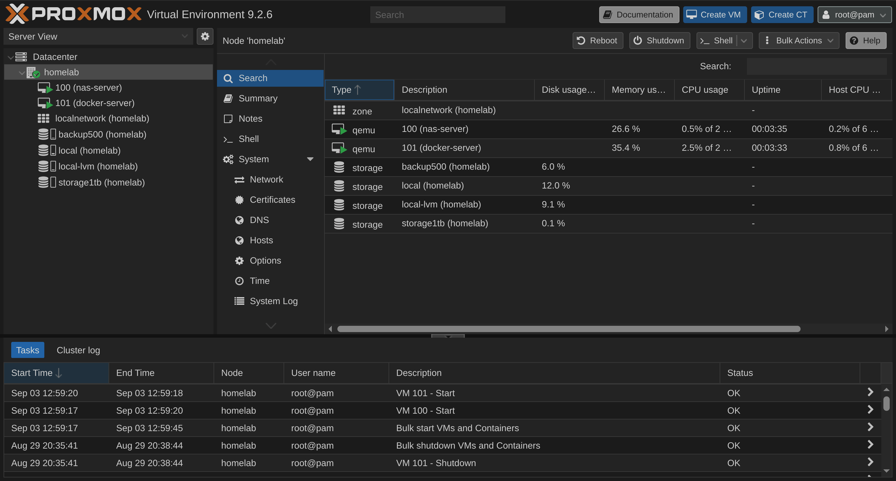
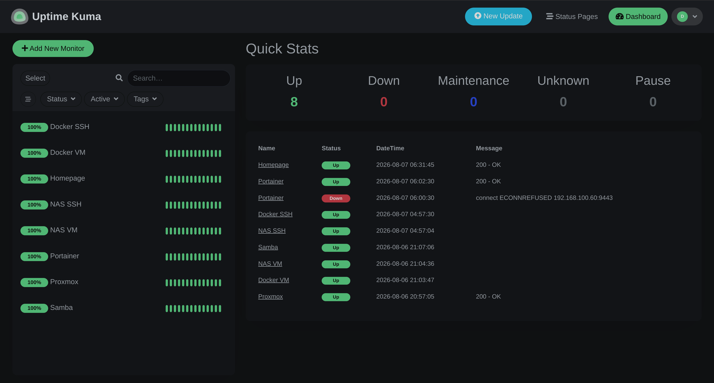
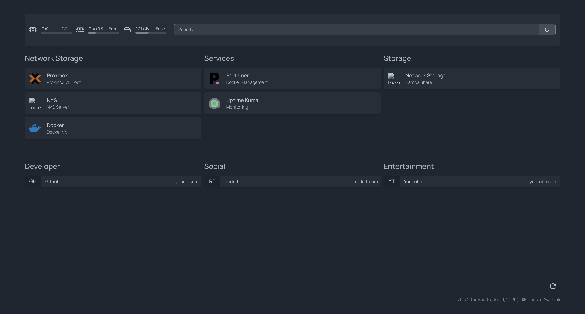

# Homelab: Self-Hosted Virtualization & Infrastructure

A personal virtualization lab built on Proxmox VE, designed to mirror core AWS
infrastructure concepts (compute, storage, networking, monitoring) in a
self-hosted environment. Built as a hands-on complement to AWS
Solutions Architect Associate study, every component maps intentionally to
a cloud equivalent.

## Why this infrastructure

I wanted to truly operate infrastructure, not just read about it. Instead
of only completing an AWS course, I built a small on-prem environment to
practice the same concepts hands-on: virtualization, isolated networks,
container orchestration, remote access, monitoring, and backups.

## Architecture

**AWS concept mapping** (why this is relevant beyond the homelab itself):

|     Homelab component      |        AWS equivalent          |
|----------------------------|--------------------------------|
|         Proxmox VE         |     EC2 (hypervisor layer)     |
|      Docker + Compose      |  ECS (container orchestration) |
|  NFS (nas → docker-server) |  EFS (shared network storage)  |
|         Tailscale          |    VPN / private networking    |
|        Uptime Kuma         | CloudWatch monitoring/alerting |
| Proxmox scheduled backups  | AWS Backup / snapshot policies |

## Software stack

**Host:** Proxmox VE (chosen over bare Ubuntu + Docker specifically for VM
isolation, snapshotting, and hands-on virtualization practice)

**nas-server** — Ubuntu Server, dedicated storage VM
- 1TB HDD mounted at `/mnt/storage`, organized into Backups / Media
  / NextCloud / Public
- NFS exports for Linux/Docker workloads; Samba shares for Windows/local devices
  and TV clients
- Kept deliberately separate from `docker-server` so storage stays stable even
  if the application VM is rebuilt

**docker-server** — Ubuntu Server, application VM
- Docker Engine + Docker Compose, stacks under `/opt/stacks/`
- **Portainer** — container management UI
- **Uptime Kuma** — monitors both VMs, Proxmox, Portainer, Samba, and SSH
  
- **Homepage** — central dashboard linking every service
  
- **Jellyfin** — media server, reads from NFS-mounted `/mnt/nas/media`
- **Tailscale** — private remote access to the whole lab without exposing
  anything publicly

## Networking

Flat `192.168.100.0/24` LAN with static DHCP reservations for both VMs. No public port forwarding — all remote access goes through Tailscale's private mesh.

**Full details:** [docs/networking.md](docs/networking.md)

## Backups

Proxmox scheduled backups run daily for both VMs to a dedicated backup disk. Verified via an actual teardown/rebuild test, not just configured and assumed working.

**Full details:** [docs/backups.md](docs/backups.md)

## What I practiced building this

- Standing up and isolating VMs on a type-1 hypervisor
- Container lifecycle management (Compose up/down, volumes, networks)
- NFS vs. Samba tradeoffs for different client types
- Headless Linux administration entirely over SSH
- Private remote access without exposing services to the public internet
- Backup strategy and recovery verification, not just backup configuration

## Roadmap

- [ ] Reverse proxy (Traefik or Caddy) in front of Docker services
- [ ] VLAN segmentation for PCs / IoT / server infrastructure
- [ ] Prometheus + Grafana for deeper metrics (beyond Uptime Kuma's
      up/down monitoring)
- [ ] IaC pass using Terraform/Ansible instead of manual
      configuration

## Notes

This repo documents configuration and architecture decisions, it
intentionally does not include credentials, private keys, or real network
identifiers beyond the local private subnet shown above.
